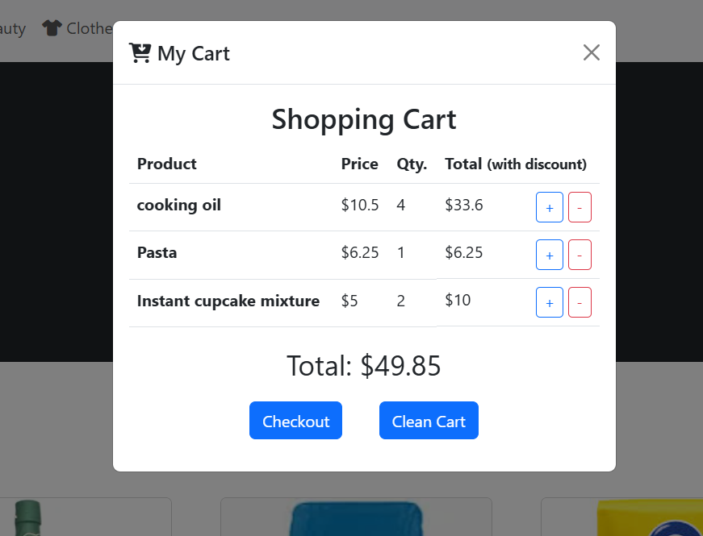
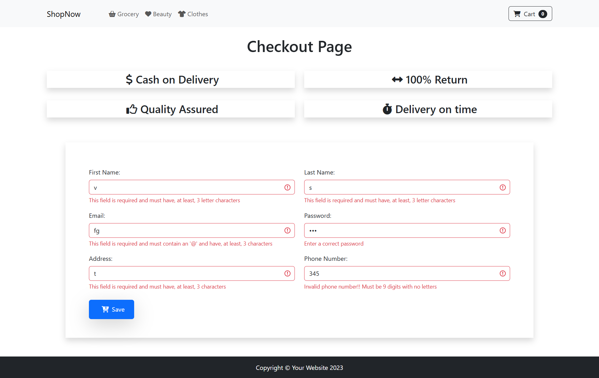

# IT S2.2 E-commerce

## 🗂️Tabla de contenidos

- [IT S2.2 E-commerce](#it-s22-e-commerce)
  - [🗂️Tabla de contenidos](#️tabla-de-contenidos)
  - [📄Descripción](#descripción)
    - [Funcionalidades](#funcionalidades)
      - [Añadir producto al carrito](#añadir-producto-al-carrito)
      - [Vaciar carrito](#vaciar-carrito)
      - [Calcular precio total](#calcular-precio-total)
      - [Aplicar promociones](#aplicar-promociones)
      - [Mostrar carrito](#mostrar-carrito)
      - [Comprobar formulario](#comprobar-formulario)
      - [Eliminar productos del carrito](#eliminar-productos-del-carrito)
      - [Añadir imagenes de productos a la web](#añadir-imagenes-de-productos-a-la-web)
  - [💻Tecnologías Utilizadas](#tecnologías-utilizadas)
  - [📋Requisitos](#requisitos)
  - [🛠️Instalación](#️instalación)
  - [▶️Ejecución](#️ejecución)
  - [🌐Despliegue](#despliegue)
  - [🤝Contribuciones](#contribuciones)

## 📄Descripción

Página web de venta de productos.

Partiendo del modelo dado, se han realizado las siguientes funcionalidades.

### Funcionalidades

#### Añadir producto al carrito

  Función buy(id): Recibe un id de producto y lo añade al carrito de la compra utilizando la variable cart

#### Vaciar carrito

  Función cleanCart(): Elimina todos los productos añadidos en la variable cart. Vigila si los productos se han pasado por referencia para evitar dejar campos innecesarios dentro.

#### Calcular precio total

  Función calculateTotal(): Calcula el precio total de los elementos de cart. Tiene en cuenta las promociones.

#### Aplicar promociones

  Función applyPromotionsCart(): Calcula el precio rebajado del producto según promociones.

#### Mostrar carrito

  Función printCart(): Muestra por pantalla el contenido de cart.

#### Comprobar formulario

  Función validate(): Comprueba la validez de los campos en el formulario checkout.

#### Eliminar productos del carrito

  Función removeFromCart(): Elimina una unidad de producto de cart. Lanza el recalculo del carrito y las promociones.

#### Añadir imagenes de productos a la web

  Modificación en la interfaz para mostrar imagenes reales de productos.

## 💻Tecnologías Utilizadas

- HTML
- Javascript
- Bootstrap
  
## 📋Requisitos

Navegador web.

## 🛠️Instalación

No es necesaria.

## ▶️Ejecución

1. Visitar la direccion de la web.

[Demo en vivo](https://soyjuandelgado.github.io/IT-S2-Ecommerce/)

## 🌐Despliegue

No aplica.

## 🤝Contribuciones

No aplica.
